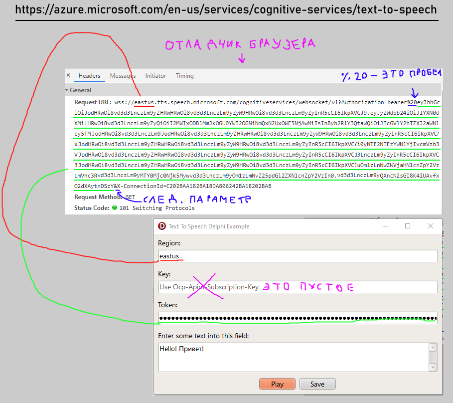

# microsoft-text-to-speech-delphi-example
## Пример использования Microsoft Azure сервиса text-to-speech 
## Преобразование текста в речь (около REST api)

**Скрин:**   

**Проект использует Bass.dll для вопроизведения файла и стандартный THttpClient для доступа к API.**  
**Экзешник под винду - в папке App.**  

**Как протестировать без аккаунта Azure:**
1) Открыть https://azure.microsoft.com/en-us/services/cognitive-services/text-to-speech/
2) Запустить отладчик сети (инструменты разработчика в вашем хромоге)
3) Проиграть текст кнопкой "Play"
4) Найти обращение к API как на скриншоте
5) Скопировать в приложение соответствующие параметры

**Подробности:**    

